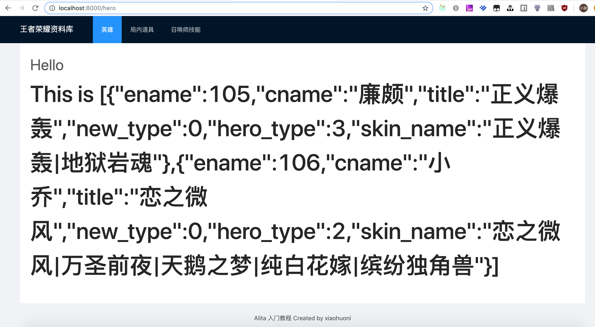
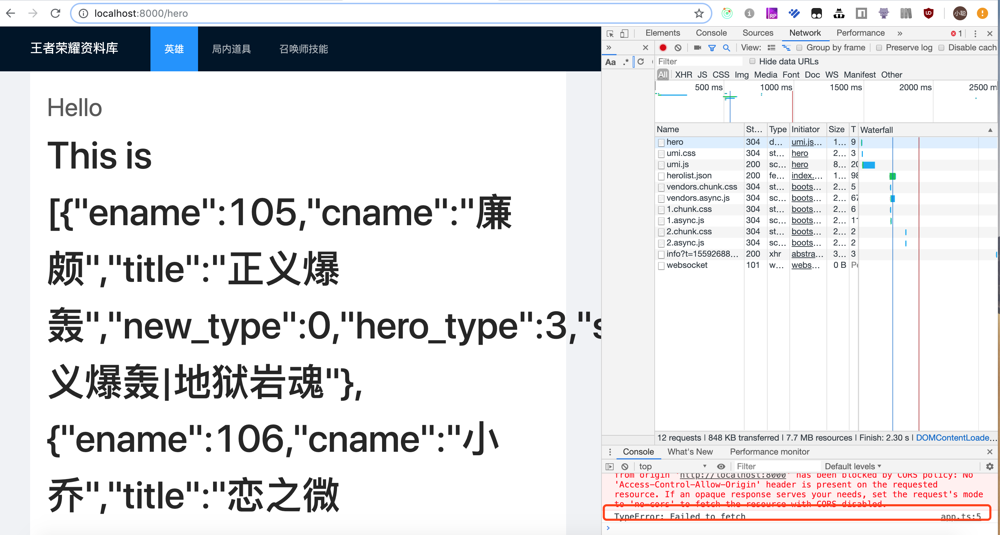

# http 请求

> 这个教程的数据，均来自[https://pvp.qq.com/](https://pvp.qq.com/)

## 在model中发起请求

`./src/models/hero.ts`

```js
import { request } from 'alita';

*fetch({ type, payload }, { put, call, select }) {
  const data = yield request('https://pvp.qq.com/web201605/js/herolist.json');
  const localData = [
    {
      ename: 105,
      cname: '廉颇',
      title: '正义爆轰',
      new_type: 0,
      hero_type: 3,
      skin_name: '正义爆轰|地狱岩魂',
    },
    {
      ename: 106,
      cname: '小乔',
      title: '恋之微风',
      new_type: 0,
      hero_type: 2,
      skin_name: '恋之微风|万圣前夜|天鹅之梦|纯白花嫁|缤纷独角兽',
    },
  ];
  yield put({
    type: 'save',
    payload: {
      heros: data || localData,
    },
  });
},
```

这里我们直接请求了王者荣耀官方的接口地址



这时候我们发现页面中并没有取得接口数据，但是在我们的代码逻辑中，就算请求不到数据，会使用本地的数据。这时候我们打开控制台，查看一下网络请求情况。


- step1 首先我们查看了网络请求情况，正确响应200，并且已有数据返回(也可能存在数据未返回的情况，请继续往下看)
- step2 查看console，发现打印了一个错误

这个错误在web开发中，特别是前期接口调试的时候，是比较常见的错误，它说明了请求存在跨域访问情况。因为请求发生了错误，所以我们的代码直接就挂了。这里我们可以先处理代码挂掉的问题。

## 捕获异常

./src/app.ts

> 在js项目中为src/app.js

```javascript
export const request = {
  prefix: '',
  errorHandler: (error) => {
    // 集中处理错误
    console.log(error);
  },
};
```

使用errorHandler捕获请求异常。请求不到网络数据，使用了本地的数据。



到这里，我们已经正确发起了一个http请求，虽然他没有正确响应，页面中我们也没有取得网络上的数据，但是，它确实是发起了，如果请求的接口不存在跨域问题的话，那么这里就能取到数据了。

## 本章节代码

[alita github: feat-httpRequest分支](https://github.com/alitajs/alitaDemo/tree/feat-httpRequest)

