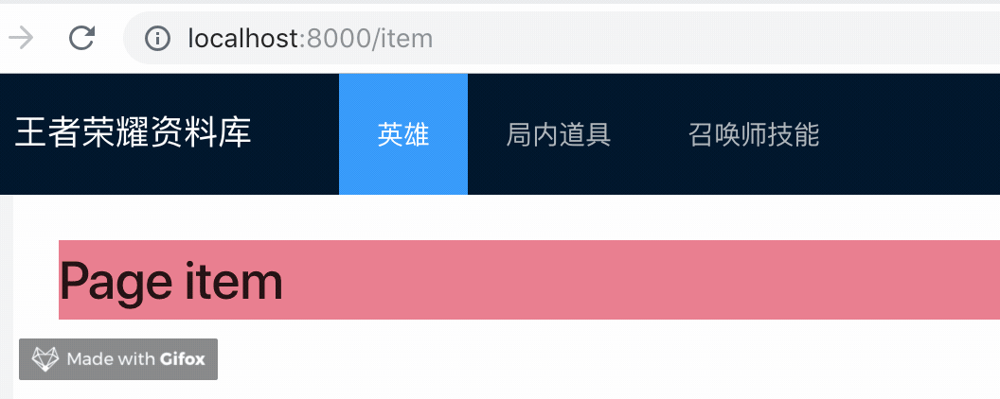

# 导航到页面

## 添加页面导航

`./src/layouts/index.tsx`

原始代码增加了路由配置，demo 中暂时不需要，可以先删除布局代码。

```js
<Menu theme="dark" mode="horizontal" defaultSelectedKeys={['1']} style={{ lineHeight: '64px' }}>
  <Menu.Item key="1">英雄</Menu.Item>
  <Menu.Item key="2">局内道具</Menu.Item>
  <Menu.Item key="3">召唤师技能</Menu.Item>
</Menu>
```

在全局布局那一小节里面，我们为页面增加了导航组件，这小节，我们就来处理如何导航到页面。

umi提供了两种导航到页面的能力，一种是命令式（使用 `router` 方法， `router.push('/list')` ），一种是声明式（使用 `Link` 组件，`<Link to="/list">Go to list page</Link>` ）。

> 命令式的用法，在后续章节中体现，这里使用声明式。

```js
import { Link } from 'alita';
<Menu ...>
  <Menu.Item key="1">
    <Link to="hero">英雄</Link>
  </Menu.Item>
  <Menu.Item key="2">
    <Link to="item">局内道具</Link>
  </Menu.Item>
  <Menu.Item key="3">
    <Link to="summoner">召唤师技能</Link>
  </Menu.Item>
</Menu>
```



## 使导航和路由一致

从效果来看，基本上已经实现了导航到页面的功能了，但是，你注意看一下，当页面刷新时，被选中的 `tab` 和当前的路由不一致。因为 `Menu` 的属性。

```
defaultSelectedKeys={['1']}
```

你刷新就选中的是 `key` 为 `1` 的 `tab`。因此我们应该通过当前路由来编辑这个值。

```diff
- const BasicLayout: React.FC = ({ children ) => {
+ const BasicLayout: React.FC = ({ children, location: { pathname } }) => {
  return (
...
<Menu
  theme="dark"
  mode="horizontal"
+ defaultSelectedKeys={[pathname]}
  style={{ lineHeight: '64px' }}
>
+ <Menu.Item key="/hero">
    <Link to="hero">英雄</Link>
  </Menu.Item>
+ <Menu.Item key="/item">
    <Link to="item">局内道具</Link>
  </Menu.Item>
+ <Menu.Item key="/summoner">
    <Link to="summoner">召唤师技能</Link>
  </Menu.Item>
</Menu>
```

修改完保存，你再刷新页面，就不会出现刚才的问题了。

## 修改代码结构

为了使代码更干净，更加易于维护，我们把Menu的数据整理出来，当作menuData。

最终我们的布局文件，如下:

```diff
import styles from './index.css';
import { Layout, Menu } from 'antd';
import { Link, ConnectProps } from 'alita';
const { Header, Content, Footer } = Layout;
+ const menuData = [
+  { route: 'hero', name: '英雄' },
+  { route: 'item', name: '局内道具' },
+  { route: 'summoner', name: '召唤师技能' },
+];
+
+ interface BasicLayoutProps extends ConnectProps {}
- const BasicLayout: React.FC = ({ children, location: { pathname } }) => {
+ const BasicLayout: React.FC<BasicLayoutProps> = ({ children, location: { pathname } }) => {
  return (
    <Layout>
      <Header>
        <div className={styles.logo}>王者荣耀资料库 </div>
        <Menu
          theme="dark"
          mode="horizontal"
          defaultSelectedKeys={[pathname]}
          style={{ lineHeight: '64px' }}
        >
+          {menuData.map(menu => (
+            <Menu.Item key={`/${menu.route}`}>
+              <Link to={menu.route}>{menu.name}</Link>
+            </Menu.Item>
+          ))}
        </Menu>
      </Header>
      <Content style={{ padding: '0 50px' }}>
        <div style={{ background: '#fff', padding: 24, minHeight: 280 }}>{children}</div>
      </Content>
      <Footer style={{ textAlign: 'center' }}>Alita 入门教程 Created by xiaohuoni</Footer>
    </Layout>
  );
}
export default BasicLayout;
```

这样子修改完，从功能上，并没有任何差别。

## 本章节代码

[alita github: feat-navigation分支](https://github.com/alitajs/alitaDemo/tree/feat-navigation)